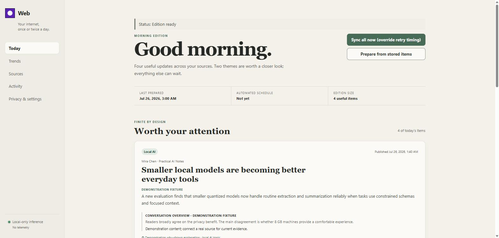

<p align="center">
  
</p>

<h1 align="center">Web</h1>

<p align="center"><strong>Your internet, once or twice a day.</strong></p>

<p align="center">
  A local-first desktop app that turns the sources you choose into a calm,
  finite, locally-summarized digest — instead of an infinite feed you check
  all day.
</p>

<p align="center">
  
  
  
</p>

<p align="center">
  
</p>

## Why this exists

Social feeds are built to never end. Web inverts that: you pick the sources,
Rust fetches and normalizes them on a schedule, an optional local model
(never the cloud) summarizes what's new, and you get a **finite edition** —
a list that ends, with a visible "you're caught up" stop, not an infinite
scroll engineered to keep you there.

- **Local-first.** SQLite on your disk. No account, no server, no telemetry.
- **Local inference only.** Summaries come from an on-machine [Ollama](https://ollama.com/)
  model if you have one installed, with a deterministic extractive fallback
  if you don't — never a cloud API call.
- **Official sources only.** No stealth scraping, no cookie import, no
  anti-bot evasion, no undocumented endpoints. See
  [`REMAINING-WORK.md`](REMAINING-WORK.md) for exactly which connectors
  that currently rules in vs. out.
- **Finite, not addictive.** No infinite scroll, no autoplay, no streaks,
  no vanity counters, no engagement-optimized ranking.

## What actually works today

This README describes the current, honest state — not the plan. The
architecture below has been through twelve independent rounds of adversarial
security/correctness/UX review; see [`REMAINING-WORK.md`](REMAINING-WORK.md)
for a from-scratch audit of what's real vs. aspirational.

| Area                        | Status                                                                                                                                                                                                                                                     |
| --------------------------- | ---------------------------------------------------------------------------------------------------------------------------------------------------------------------------------------------------------------------------------------------------------- |
| RSS/Atom sources            | **Live.** SSRF-hardened fetch (DNS pinning, private/link-local/reserved-range rejection, redirect re-validation, HTTPS-only), conditional resync, retention.                                                                                               |
| Local summarization         | **Live.** Loopback-only Ollama integration with schema-validated structured output, exact model-digest attestation, and a deterministic no-model fallback.                                                                                                 |
| Persistence                 | **Live.** Rust-owned SQLite, transactional version-gated migrations, WAL, foreign keys, generation-fenced deletion, privacy-epoch invalidation.                                                                                                            |
| Credentials                 | **Live.** OS vault only (Windows Credential Manager / macOS Keychain / Linux Secret Service), fail-closed, no plaintext fallback.                                                                                                                          |
| Scheduling                  | **Partial.** Runs only while the app window is open; no tray/background execution yet.                                                                                                                                                                     |
| Ranking                     | **Live, bounded.** Explicit-feedback-only (More/Less), per-source, gated by a minimum-signal threshold, with a 25% chronological/diversity reserve and a per-item why-shown reason; pausable in Settings. No passive/behavioral signals exist or are read. |
| Trends                      | **Live, bounded.** Deterministic lexical clustering runs as part of every digest: cross-source gate (a single source repeating itself is never a trend), same-source dedup collapse, deterministic fallback label. No model decides membership.            |
| Mastodon / Bluesky / Reddit | **Not active.** Provider-neutral connector plumbing exists; live OAuth connectors are gated on policy/infrastructure review — tracked in `REMAINING-WORK.md`.                                                                                              |

## Architecture

```
  sources (RSS today; Mastodon/Bluesky/Reddit gated)
        │
        ▼
  Rust core  ──  SQLite (WAL, migrations)
   │    │    │
   │    │    └── OS credential vault (fail-closed)
   │    └── local Ollama model (loopback only, no tools/network)
   └── narrow, typed, serde-validated Tauri commands
        │
        ▼
  React renderer (presentation only — zero filesystem/shell/network capability)
```

React never touches the network, the filesystem, or SQLite directly — every
action is a narrow, typed Rust command. The renderer's Tauri capability
grants **zero** built-in permissions; everything it can do is explicitly
listed. See [`docs/adr/`](docs/adr) for the durable architectural decisions
and [`docs/security/threat-model.md`](docs/security/threat-model.md) for the
full asset/threat/control breakdown.

## Getting started

**Prerequisites**

- Windows 10/11 (WebView2), macOS (WebKit), or a modern Linux distro (WebKitGTK 4.1)
- [Node.js](https://nodejs.org/) 24+ and [pnpm](https://pnpm.io/) 11.3+
- [Rust](https://www.rust-lang.org/) 1.96 with `rustfmt` and `clippy`
- Optional: [Ollama](https://ollama.com/) running on `127.0.0.1:11434` for local-model summaries

```bash
pnpm install
pnpm dev            # browser preview with demo data — no network, no real DB
pnpm tauri dev       # the real desktop app, backed by Rust + SQLite
```

The desktop app starts with a genuinely empty database in your OS's
per-user app-data directory — no demo content, no fixtures. Add a source
under **Sources** to get your first edition.

**Build a real installer**

```bash
pnpm tauri build     # produces a signed-pending .msi / NSIS / .dmg / AppImage in src-tauri/target
```

## Validation

```bash
pnpm verify          # format, lint, typecheck, frontend tests, build, cargo fmt/test/clippy
```

Focused commands: `pnpm test`, `pnpm build`, `pnpm rust:test`, `pnpm rust:clippy`.

## Privacy and security defaults

- No telemetry, no cloud-model fallback, no remote media by default.
- Credentials live only in the OS vault; the database stores opaque references, never raw tokens.
- Feed/model content is untrusted, length-bounded, rendered as inert text — the model gets no tools, network, or database access.
- RSS fetches reject localhost, private/link-local/shared/documentation address ranges and re-validate DNS on every redirect.
- Deleting a source removes its posts, comments, summaries, trends, feedback, and digest derivatives from the database (OS-level backups may still retain older copies).
- The SQLite file itself is not application-encrypted; Web relies on OS account permissions and full-disk encryption for at-rest protection.

Found a vulnerability? See [`SECURITY.md`](SECURITY.md) for private disclosure.

## Project layout

```
src/                    presentation-only React app + validated typed transport
src-tauri/src/          Rust commands, SQLite, connectors, local-model client, scheduler, vault
src-tauri/migrations/   append-only transactional schema
tests/fixtures/         inert deterministic connector fixtures
docs/adr/               durable architecture decisions
docs/security/          threat model
docs/product/           guardrails and connector policy
```

## Roadmap

[`REMAINING-WORK.md`](REMAINING-WORK.md) is a from-scratch, evidence-based
audit of what's genuinely done vs. claimed, the real product gap, and a
scoped design for optional git-based cross-device sync. It's the single
source of truth for what's next — read it before opening an issue asking
"does this support X yet?"

## License

[MIT](LICENSE)
